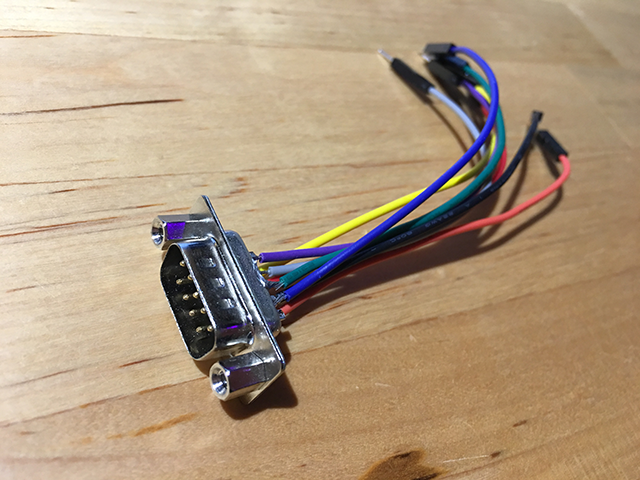
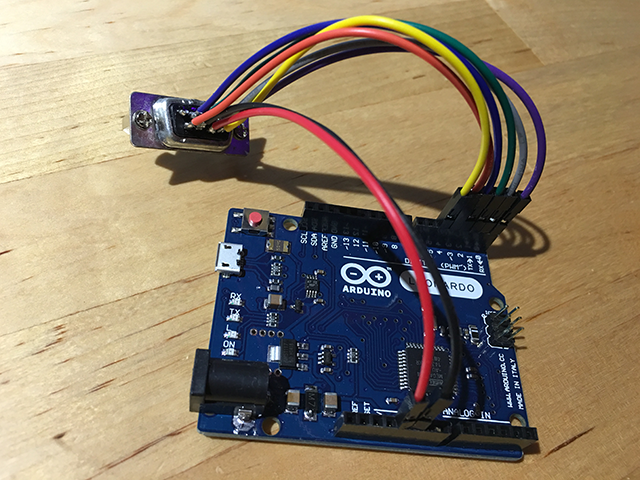
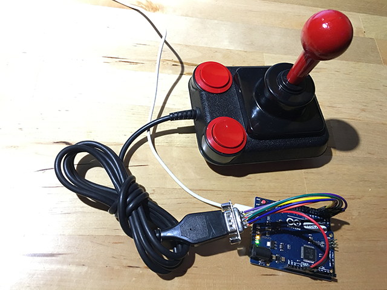

# AtariStick

Arduino library for making your old Atari/C64/Amiga joystick appear as a USB HID joystick to a modern PC/Mac/Raspberry Pi/etc. It's been tested on an Arduino Leonardo and a SparkFun Pro Micro clone, and it should work on any Arduino clone with a ATMega32U4 or similar (with built in USB, not FTDI or CH340/341). At the time of writing, the library only supports one joystick.

To make this all work, you need some hookup wires and a male DB-9 connector (it's the 9-pin PC serial connector), which you can source from an old computer or serial cable, or buy online. Optional extras are some dupont male/female pins (depenting on how your Arduino board is set up) and a soldering iron.

With the male DB-9 connector pins facing you, the pin numbering is like this:

If you're just using the example sketch from the library, connect the following DB-9 pins to the corresponding digital pins on your Arduino like so:

* DB-9 pin 1 (up) to Arduino D0.
* DB-9 pin 2 (down) to Arduino D1.
* DB-9 pin 3 (left) to Arduino D2.
* DB-9 pin 4 (right) to Arduino D3.
* DB-9 pin 5 is not used for joysticks.
* DB-9 pin 6 (button1) to Arduino D4.
* DB-9 pin 7 (+5v) to Arduino +5v VCC (optional; sometimes required by hardware autofire).
* DB-9 pin 8 (GND) to Arduino GND.
* DB-9 pin 9 (button2) to Arduino D5 (optional; only some joysticks use this).

As you can see, a bare minimum hookup uses pins 1, 2, 3, 4, 6 and 8. Note that even with this minimum hookup the autofire on my Zipstick works, so I'm assuming it sources its power from other pins.

Once you're done with all the wiring, you'll end up with something that looks like this:

Upload the example sketch to your Arduino, plug the joystick in, and Bob's your uncle. The Arduino should now present 2 buttons, and an X and a Y axis, both ranging from -127 to 127. You may now use your old joystick in VICE, UAE, Mame and so on.

The end result might look like this:

If you need more information, look at the source code for the library (it's fairly simple), or raise an issue on GitHub.

The GitHub repository for this library is: https://github.com/kluzzebass/AtariStick
