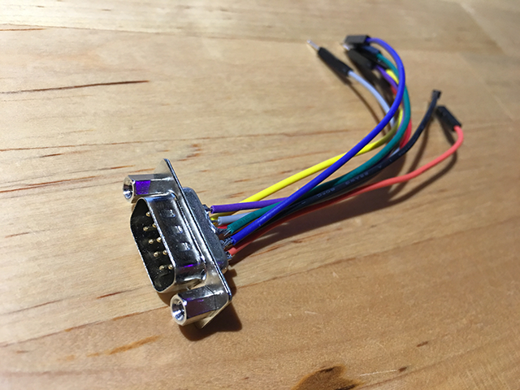
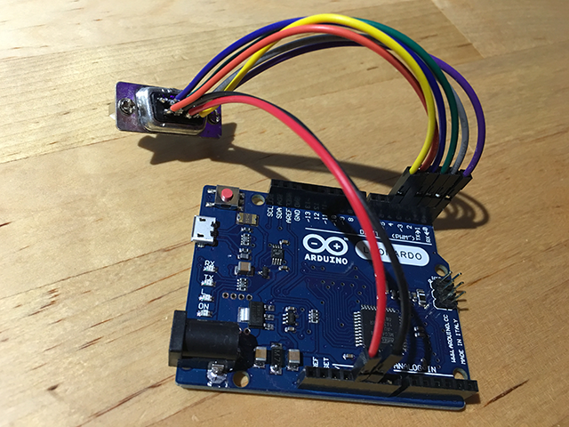
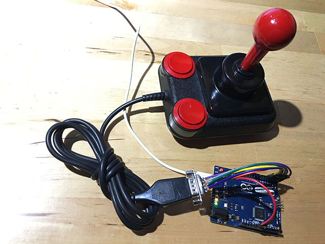

# AtariStick

**Note: This library relies on the Debounce library. Make sure you grab both!**

Arduino library for making your old Atari/C64/Amiga joystick appear as a USB HID joystick to a modern PC/Mac/Raspberry Pi/etc. It's been tested on an Arduino Leonardo and a SparkFun Pro Micro clone, and it should work on any Arduino clone with a ATMega32U4 or similar (with built in USB, not FTDI or CH340/341). It supports one or more joysticks from a single board — each stick is presented to the host as its own HID joystick.

To make this all work, you need some hookup wires and a male DB-9 connector (it's the 9-pin PC serial connector), which you can source from an old computer or serial cable, or buy online. Optional extras are some dupont male/female pins (depenting on how your Arduino board is set up) and a soldering iron.

With the male DB-9 connector pins facing you, the pin numbering is like this:


If you're just using the example sketch from the library, connect the following DB-9 pins to the corresponding digital pins on your Arduino like so:

* DB-9 pin 1 (up) to Arduino D0.
* DB-9 pin 2 (down) to Arduino D1.
* DB-9 pin 3 (left) to Arduino D2.
* DB-9 pin 4 (right) to Arduino D3.
* DB-9 pin 5 is not used for joysticks.
* DB-9 pin 6 (button1) to Arduino D4.
* DB-9 pin 7 (+5v) to Arduino +5v VCC (optional; sometimes required by hardware autofire).
* DB-9 pin 8 (GND) to Arduino GND.
* DB-9 pin 9 (button2) to Arduino D5 (optional; only some joysticks use this).

As you can see, a bare minimum hookup uses pins 1, 2, 3, 4, 6 and 8. Note that even with this minimum hookup the autofire on my Zipstick works, so I'm assuming it sources its power from other pins.

Once you're done with all the wiring, you'll end up with something that looks like this:



Upload the example sketch to your Arduino, plug the joystick in, and Bob's your uncle. The Arduino should now present 2 buttons, and an X and a Y axis, both ranging from -127 to 127. You may now use your old joystick in VICE, UAE, Mame and so on.

The end result might look like this:


## Two joysticks at once

A single board can drive more than one joystick. Each `AtariStick` instance registers as its own USB HID interface, so the host enumerates each stick as a separate joystick. Just declare one instance per stick and give each its own set of digital pins:

```cpp
AtariStick stick1 = AtariStick(1000);
AtariStick stick2 = AtariStick(1000);
```

Wire the second joystick to a second DB-9 connector and a free set of digital pins. The `DualJoystickAdapter` example uses these pins:

| Function | DB-9 pin | Stick 1  | Stick 2    |
|----------|----------|----------|------------|
| Up       | 1        | D0 (RXI) | D6         |
| Down     | 2        | D1 (TXO) | D7         |
| Left     | 3        | D2       | D8         |
| Right    | 4        | D3       | D9         |
| Button 1 | 6        | D4       | D10        |
| Button 2 | 9        | D5       | D16 (MOSI) |
| GND      | 8        | GND      | GND        |

Both DB-9 grounds share the Arduino GND rail. DB-9 pin 5 is unused, and pin 7 (+5V) is optional (only some joysticks need it for hardware autofire) — same as the single-stick hookup above.

**This table is for the SparkFun Pro Micro pinout, not the Leonardo.** The silkscreen labels and the D16 mapping below are Pro Micro specific:

* On the silkscreen, `RXI` is D0 and `TXO` is D1. They work fine as plain digital inputs; just don't use `Serial1` in your sketch.
* Stick 2 runs D6–D10 contiguously, then jumps to D16 (the MOSI pin) for Button 2, since there's no clean D11 next to D10 on the Pro Micro. D16 is fine as a digital input.

On an Arduino Leonardo the broken-out pins differ — it exposes D0–D13 plus A0–A5, but not D14–D16 as labelled header pins (MOSI/MISO/SCK are on the ICSP header). Stick 2's D6–D10 are fine on a Leonardo; only the D16 (Button 2) entry needs to change — map it to a free pin such as D11 or A0 and update the example's `#define`s to match. Or just pick any six free digital pins for Stick 2.

Any free digital pins will do; the ATmega32U4 boards have plenty for two sticks (2 × 6 = 12 pins).

Each stick is its own USB HID interface with its own endpoint, rather than a report id inside a shared interface. Hosts that enumerate by device instead of by HID collection — VICE and VirtualC64 among them — only see the second stick this way. The library plugs in one interface per stick instead of using the stock single-interface Arduino HID layer.

Each stick uses one HID endpoint. With CDC serial taking 3 of the ATmega32U4's ~7 usable endpoints, that leaves room for about four sticks.

If you need more information, look at the source code for the library (it's fairly simple), or raise an issue on GitHub.

The GitHub repository for this library is: https://github.com/kluzzebass/AtariStick
